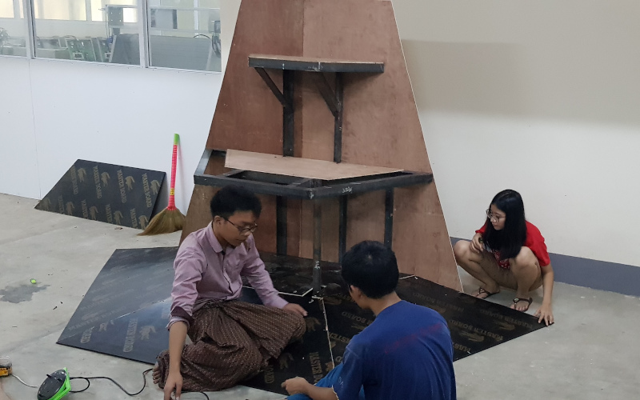

# First Global Team Myanmar 2019

​        We won Championship in Myanmar Roboleague 2019, and managed to get into First Global Challenge 2019.
​        188 countries participated in the match and we won Judges First Award.
​        Representative Team of Myanmar in First Global Challenge 2019 DUBAI.
​        (Left to Right) Hein Htut Zaw, Win Naing Kyaw, Thaw Dar San, Thiha Zaw, Khant Kyaw Khaung, Htet Myet Aung
 

​        We named our robot **Flyin Dutchman** because of its task to do adventures in the seas and recycle.
​        It took 3 months for us to implement the system.
​        The engineering notebook could be accessed in the docs folder.

​        The prototype arena that we made ourselves with the limited materials for the test drive of our robot.
​        The task is to shoot the small balls into the topmost basket which result in 20 points, and to put the big balls into the middle basket, each of them having 10 points
​        Finally, the robot has to save itself from water by pulling up the bar, resulting in 30 points.
​        Three countries become allies and compete with the opponent alliance of 3 countries every game. 

https://user-images.githubusercontent.com/54346256/211992671-b3b62e66-8597-42f4-8b2f-79bbc7516997.mp4

​        **Robot Flywheel Mechanism**. The main goal is to grab the balls scattered throughout the floor and shoot them to the top basket.
​        **PIDF** control system is used to control the velocity of flywheel and the ball.
​        Mathematics and physics are heavily applied to calculate the required input needed.

https://user-images.githubusercontent.com/54346256/211992585-f3b5dea6-e92e-49b8-937c-f766eecf2347.mp4

​        Our best game in FGC2019.
​        Even though we did not win any top spots, we managed to get **Judges First Award** for implementation, robot design, mathematics concepts, and robot engineering book.

https://user-images.githubusercontent.com/54346256/211995427-07925cd8-f9b8-4d2f-a071-48510a60a774.mp4
​        Fun bottle cap challenge with the flywheel.

