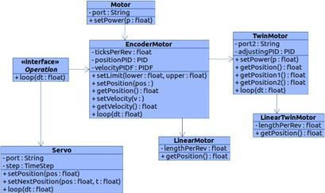

# First Global Team Myanmar 2019

## REPRESENTING MYANMAR 

​        We won the Championship in Myanmar Roboleague 2019 and managed to get into the First Global Challenge 2019.
​        188 countries participated in the match and we won the Judges First Award.
​        Representative Team of Myanmar in First Global Challenge 2019 DUBAI.
​        (Left to Right) Hein Htut Zaw, Win Naing Kyaw, Thaw Dar San, Thiha Zaw, Khant Kyaw Khaung, Htet Myet Aung
 
## OUR ROBOT

  
  

  
  

​We named our robot **Flyin Dutchman**. It took 3 months for us to implement the system. We used REV robotics kit with main language being JAVA. Our main task is to recycling as many trash(balls) as possible before the flood, and when the timer is up we would have to dock ourselves onto the bar. Saving small balls onto the toppest bin is worth 20 points, big balls into middle basket is worth 10 points, and safely docking is worth 30 points. ​Three countries become allies and compete with the opponent alliance of 3 countries every game. 

## MECHANICAL DESIGN
### FLYWHEEL MECHANISM

  
  

For shooting micro-pollutants, the pollutants will be placed between the two wheels which are rotating very high speed. When the pollutants get into those wheels, they will be fired to the desired location. 
The two wheels which act as shooters will be controlled by a single motor and connected through gears. They will be rotating with same speed so that the pollutants won’t change direction but move straight while shooting. 
The total gear ratio for speed will be 25/6 x  3/1 = 25/2  or 25:2 (12.5) which means that the speed will be 12.5 faster than the original speed generated by the motor. Increasing the speed makes the micro-pollutants push with greater kinetic energy.

### BALL LIFTING MECHANISM & DOCKING MECHANISM

     

**Big Balls Collecting Mechanism**: Mechanism for collecting macro-pollutants which is jointed with the docking mechanism. The macro-pollutants are collected and moved to the top of the robot with belts and a linear motion mechanism. In the end, there is a servo motor for placing the pollutant to the “recycle level”. There is also no container in this mechanism and the pollutants will be saved in the beltway. The maximum number of pollutants that can be saved is three before taking them to the “recycle level”. 

  
  

**Base Omni Wheel Mechanism**: Used omni wheel to promote freedom of mobility. 
**Docking and Automatic Macropollutant Mechanism**: The robot's docking will be elevated according to user input and when the angles are correct, it will be lowered, thus safely dockig on the ball frame. As for the macropollutants, at most 3 pollutants could be carried at the same time and with one user input, the servos will automatically push these pollutants onto the 2nd level of the ball frame.

## CODE DESIGN

  
  

  
One big problem is even if the manual control is user-friendly, it still has a high chance of missing the balls. It is challenging to aim from the player’s perspective. So, an automatic function for aiming is used. This is where we put a lot of effort into software design. This uses extra sensors, a webcam, and sensor fusion algorithms.
These are the class hierarchies of the two main schemes that we have used for the robot.
The left diagram is the class hierarchy of motor control and the right is that of automatic aiming and sensor fusion.

## THE COMPETITION

https://user-images.githubusercontent.com/54346256/211996258-93493e66-cd03-49bf-930e-35b9d26e9ace.mp4

The test run from five days before the competition. By user input in controller pad, the robot will move and collect the ball, and shoot the ball into the top bin by calculating the needed velocity on its own.
We developed an automated moving system to shooting position, but due to time constraints, we could not devlop it to be reliable enough for the competition.

https://user-images.githubusercontent.com/54346256/211992585-f3b5dea6-e92e-49b8-937c-f766eecf2347.mp4

​Our best game in FGC2019.
​Even though we did not win any top spots, we managed to get **Judges First Award** for software design, robot design, mathematics concepts, and robot engineering book.

## Thank You!

https://user-images.githubusercontent.com/54346256/211996747-ee0f5630-fde8-4506-8937-3ed4b99e426d.mp4

**In depth Documentatoin** could be viewed in the Engineering Notebook.pdf file. In this documentation, you could read about Sensor Fusion, Filtering Algorithms, Feedback Cntrol Algorithms, Automation and our derivations for velocity of the flywheel, and the obstacles we faced.

Thank you for being interested in our project. 
